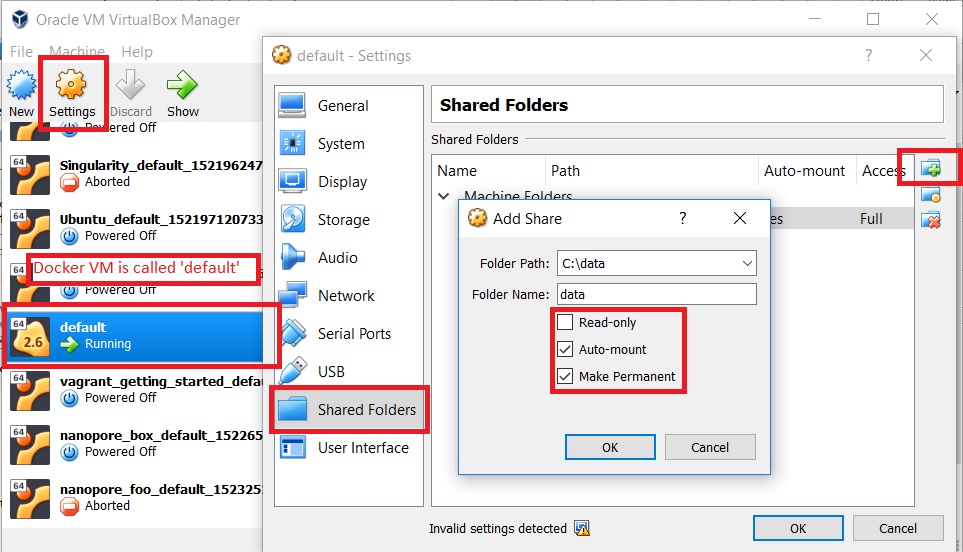

# What is poreduck
.pull-left[
Two simple programs designed to:
1. tarMyFast5:
  + Pacakge fast5 data on a laptop ready for transfer to a server. 
  + Provide some theoretical run metrics
2. albacoreHPC
  + Run albacore on said server.
  + And generate some actual run metrics.
]
.pull-right[

]

---

# Downloading the test data.
We have been fortunate to have a repository on AARNET's cloud stor.  
Please download the following [compressed zip file](https://cloudstor.aarnet.edu.au/plus/s/YF69Ppmh5xTg3LQ) and extract the reads folder into the appropriate directory.

---

# Tar my fast5 steps
1. Install Docker 

2. Download docker image

3. Create a docker container

4. Copy across the samplesheet into the container

5. Commit the container to a new image

6. Mount the reads folder and run the new image

7. Rsyncing to a server

---

# Installing Docker (5-10 mins)

**Windows and Mac users**  
Docker enables us to run the same program on every platform.

We will use the [Docker toolbox](https://docs.docker.com/toolbox/overview/) for Windows/Mac systems.
Docker toolbox is the legacy system and is compatible on Windows 7 and above.

.small[You should also install Git Bash and Kitematic as recommended by the docker installer]

**Ubuntu users**  
`sudo apt-get install docker.io`  
`sudo groupadd docker`  
`sudo gpasswd -a $USER docker`  
Now log out and back in or run `sudo run newgrp docker`.  
Then `sudo service docker restart`  
You should not have to use sudo when running docker commands from now on.

---

# Downloading the docker image (10-mins)

.pull-left[
## Terminal by platfrom
**Windows users**  
Open up Git Bash

**Mac Users**  
Open up Docker Quick Start Terminal

**Ubuntu users**  
Open up a new terminal
]

.pull-right[
## Commands to run
```{bash, eval=FALSE}
# Download the image
docker pull alexiswl/poreduck
# List the images
docker images
# Create a docker instance
docker container create alexiswl/poreduck
# See the name of the instance
docker ps -a
# The container name will be on the far right
# It will be something like elegant_swan
# For the rest of this tutorial, 
# please substitute elegant_swan with your container.
```
]

---

# Copy across the samplesheet (3 mins)
.pull-left[
## About the samplesheet
The samplesheet is a tab delimited file. 
The samplesheet has the following header columns.
1. SampleName .tiny[as named in MinKNOW]
  + *LAMBDA_RAPID_TEST*
2. UTCMuxStartDate:
  + *20170628*
3. UTCMuxStartTime:
  + *0521*
4. UTCSeqStartDate:
  + *20170628*
5. UTCSeqStartTime:
  + *0526*
.tiny[*If you forgot to name your sample in MinKNOW, use '%' followed by your sample name of choice.]
]
.pull-right[
## Commands to run
```{bash, eval=FALSE}
# Download the test samplesheet
wget -O samplesheet.tsv https://raw.github.com/alexiswl/ASimpleNanoporeTutorial/master/samplesheet.tsv
# View the samplesheet
cat samplesheet.tsv
# Copy the samplesheet into the container
docker container cp samplesheet.tsv elegant_swan:/samplesheet.tsv
```
]

---

# Committing the container (3 mins)
We will now convert the modified container back into an image.

.pull-left[
## Containers vs images
The terms 'containers' and 'images' are sometimes interchanged.
They are different, for more information
this [stack-overflow](https://stackoverflow.com/questions/23735149/what-is-the-difference-between-a-docker-image-and-a-container) thread is worth reads.
]
.pull-right[
## Commands to run
```{bash, eval=FALSE}
# Commit the container
docker container commit elegant_swan poreduck_lambda
# View the list of images
docker images
```
]

---

## Allowing a mount to docker. (3 mins) .tiny["Windows/Mac"]

.pull-left[
.small[
1. Shut down KiteMatic and open up VirtualBox.
2. By default, docker only allows mounts the user directory.
3. Open up virtual box, select default. 
4. Mount `C:/data/` or `/Library/MinKNOW/data/` to `/data`. 
5. Press Ctrl+F to shut down the Virtual box.
6. Reopen KiteMatic.
]
]
.pull-right[

]

---

## Mounting the reads path / running the container
Mounting uses the --volume parameter.
It allows the running container to read/write and execute files on the laptop.
By default, no files or folders are accessible to the container
.pull-left[
### Default /path/to/reads by platform
**Windows users**
`/c/data`

**Mac Users**
`/Library/MinKNOW/data/reads`

**Ubuntu users**
`/var/lib/MinKNOW/data/reads`
]
.pull-right[
## Commands to run
```{bash, eval=FALSE}
# Make note of quotes
docker run --volume '/path/to/reads':/data/reads poreduck_lambda tarMyFast5 --reads_path /data/reads --samplesheet /root/samplesheet.tsv
```
]


---

You're done!
You will now see next to fast5 for each of your runs, there will be a 'metadata' folder and a 'plots' folder.
The metadata folder contains a tsv file for each folder in the fast5 folder.

# Transferring your data to a server with rsync
Running rsync to transfer data to your server.

Before running the rsync tutorial, please see the 'creating an ssh-key' tutorial.
This will mean you not have to enter a password, everytime the rsync runs.